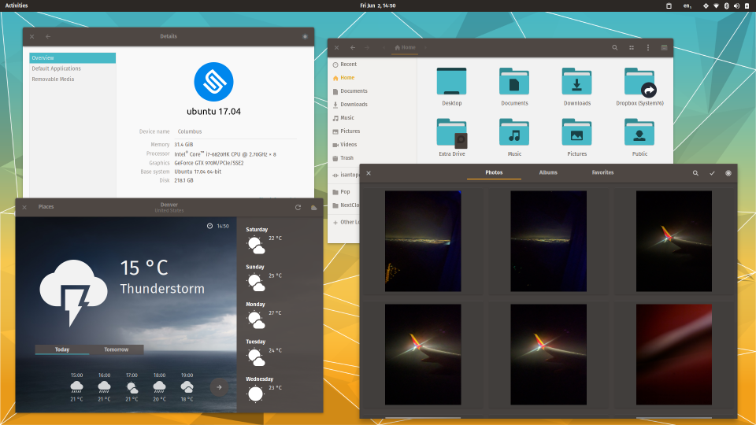
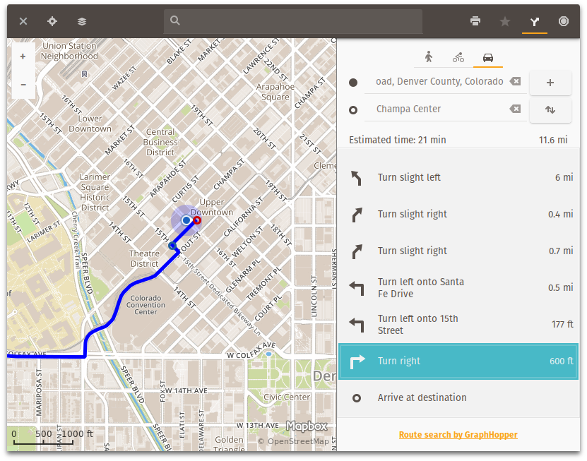
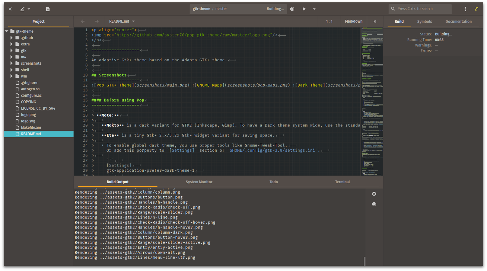

<p align="center">

</p>

-------------------

An adaptive Gtk+ theme based on the Materia GTK+ theme.


## Screenshots
-------------------
  


### Required Components
-------------------
Pop supports Gtk+ 3.22.x, 3.20.x and 3.18.x

 ```
 * Gtk+-3.0             >= 3.18.9
 * Gtk+-2.0             >= 2.24.30
 * gtk2-engines-pixbuf  >= 2.24.30
 * gtk2-engines-murrine >= 0.98.1
 ```

#### Supported Desktop Environments
------------------------------

 ```
 * GNOME-Shell     >= 3.18.3
 * GNOME-Flashback >= 3.18.2
 * Budgie-Desktop  >= 10.2.7
 * Unity7          >= 7.4.0
 * XFce4           >= 4.12.2
 * Mate            >= 1.14.0 (Gtk+ 3.2x only)
 * LXDE            >= 0.99.1 (Gtk+ 2.x only)
 ```

 > **Note:**
 >
 >   * Mate-Desktop and Pantheon support are W.I.P.


### Recommendations

- For GTK, use icons alongside [Pop Icon Theme](https://github.com/system76/pop-icon-theme)
- For fonts, use:
 > Window Titles: Fira Sans SemiBold 10

 > Interface: Fira Sans Book 10

 > Documents: Roboto Slab Regular 11

 > Monospace: Fira Mono Regular 11


### Installation

Pop is intended to be installed through the package manager. Packages for Ubuntu are available in PPA:
```
sudo add-apt-repository ppa:system76/pop
sudo apt update
sudo apt install pop-theme
```
It's recommended to use the `pop-theme` metapackage, as this will pull in all components of the look. However, individual components can be installed separately, e.g:
```
sudo apt install pop-gtk-theme
```
It's also recommended to restart the GNOME Shell after applying the theme of your choice.

Enter the Shell's command launcher
```
Alt + F2
```

This will restart the Shell after you hit Enter
```
r
```


### Installation from Git Source
----------------------------

###### Note: You must have sassc installed in order to build Pop. Users of 17.04 or later can install it using:

```
sudo apt install libsass0 sassc
```

1. If previous versions were installed/existed, remove them first.

 ```
 sudo apt remove system76-pop-gtk-theme
 sudo make uninstall
 sudo rm -rf /usr/share/themes/{Pop,Pop-Eta,Pop-Nokto,Pop-Nokto-Eta}
 rm -rf ~/.local/share/themes/{Pop,Pop-Eta,Pop-Nokto,Pop-Nokto-Eta}
 rm -rf ~/.themes/{Pop,Pop-Eta,Pop-Nokto,Pop-Nokto-Eta}
 ```

2. Generate the CSS using SASS.

```
make
```

* Optional: If you made changes to the art assest, you need to regenerate them as well:
```
make assets
```

3. Install the theme.

```
sudo make install
```


TODO
----
* Prepare for Steam theming (priority: Low)

Public License
--------------
 GPLv2.0

 > **Note:**
 >
 > SVG files are licensed under CC BY-SA 4.0

Special Thanks to
--------------
 Nana-4, the developer of Materia.
 tista500 and the Adapta Theme Project: https://github.com/adapta-project/

